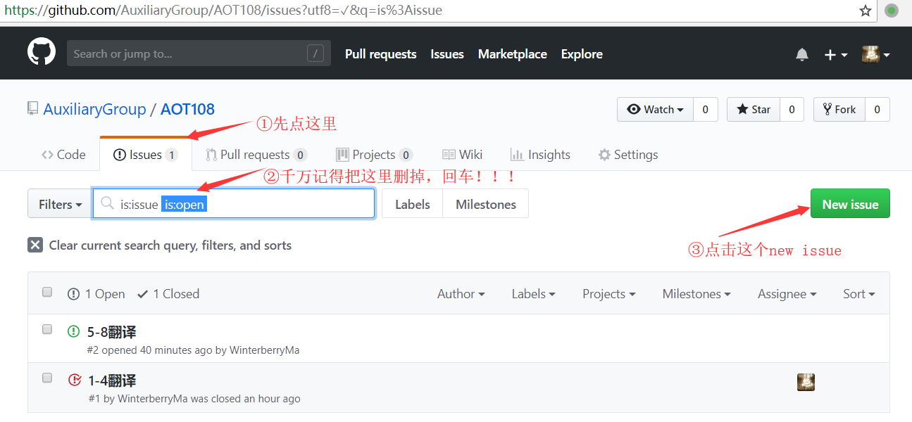
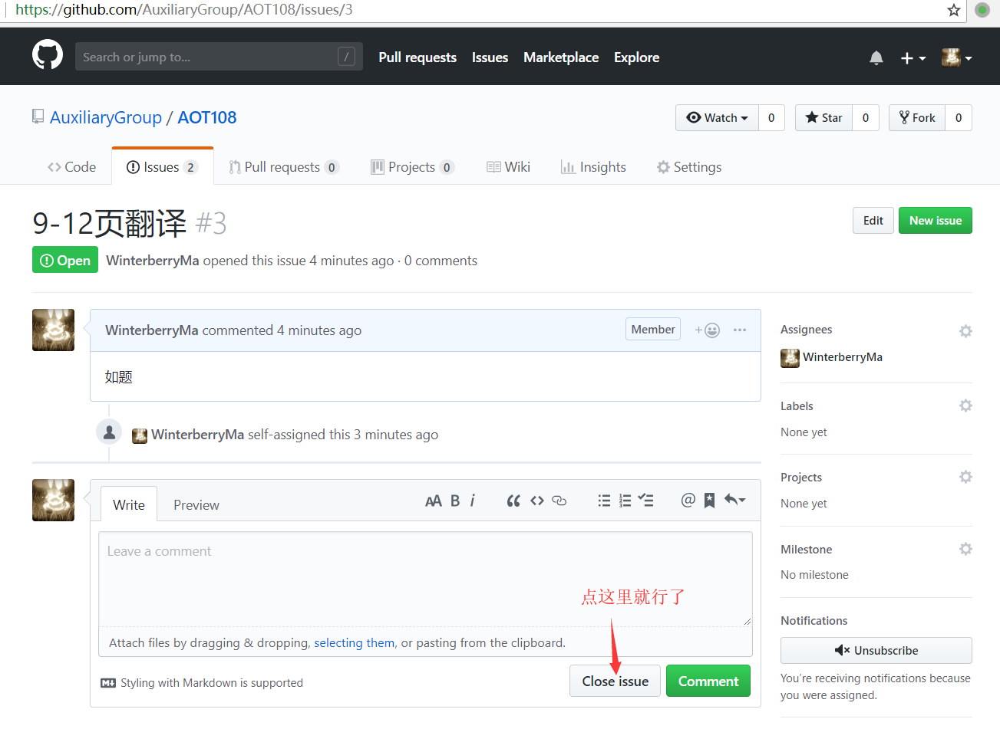

# AuxiliaryDemo
供组内使用的炒鸡好上手的GitHub教程

[TOC]

## 0.为什么要用<del>Gay</del>GitHub
不好奇为什么要用GitHub的，和不想看我废话的请点击[这里](#注册和加入汉化组)

[GitHub](https://github.com)是现在全球最大的<del>同性交友</del>代码管理平台，提供了很多强大的功能。其最开始的设计目的，是提供<b>多人、长时间、分布式</b>的代码管理。说人话就是，要多人合作，用它准没错；要多次修改才能完成的东西，用它准没错；人人平等的多人合作任务，用它准没错。

GitHub现在已经成长为全球最大的代码管理、分享平台，非常稳定，而且因为其开放性和完善地像论坛一样的issue管理功能，很多与代码无关的工作也可以再GitHub上完成，包括某些信息的发布和分享等。即使你把发布者查了水表，只要有人还复制了一份出来，那么信息就还会存在。一个典型的例子是今年早些时候引发广泛讨论的北大岳昕事件……扯远了。另外，它还有其他的优点，比如，<b>没有广告！</b>比如，不会被墙！对，因为这是程序员的刚需，如果你要把它墙了，筑墙的超（程）大（序）巨（员）们都会分分钟暴走给你看。

吹了这么久，组内朋友可能问，我们在qq群里一样能做合作的工作，为什么还要费事地用这么一个网站呢？问得好。来看这样一段聊天记录

<!-- 
 -->

<!-- 
 -->

群里有人刚刚醒的话，问一句“哪里到哪里翻完了吗”，这次有人见到了才避免了重复劳动，但如果是比较非洲人的成员（比如苦逼的Fe-57），没有看到一个小时前的聊天记录里，某几张已经有人认领，就像这样

<!-- 
 -->

<!-- 
 -->

就会造成重复劳动……悲惨啊

不只是我们初翻人员，后续校对、终校等大佬统计完成进度时也会遇到困难。比如

一句简单的“根据目前群里的聊天记录”，透露出多少辛酸，需要翻多久大家的水群记录，然后才能画出这样一张表。我们在群里简单地敲一下“1-4完成”然后回车一下，统计的大佬得翻半天……痛苦 
用excel统计吗？那统计的人的文件夹里就会出现这样的东西

到时候，可就不只是这5个文件，到二三十个都是有可能的

Google Doc、石墨、一起写等多人同时编辑工具虽然能解决统计的难题，但也会有一些问题
* 如果有人手一滑，改了另一个成员的内容，当时谁都没注意到，两小时后才发现问题，总不能ctrl+z撤销大家所有的工作，只为了找那一个东西回来
* 或者谁哪里翻出了了严重错误，大家说是他的问题，但他可以说“我交上去的时候还是好好的，是不是谁修改了？”死不承认，大家就不能<del>让他女装</del>监督他改正错误了
* 更有甚者，万一哪位（比如被初代王操控了）鬼使神差地删了整个文件，那大家是不是连把他献祭的心情都有了？

而GitHub就不会有这样的问题。GitHub可以追踪每一次修改的作者，可以时光机穿梭，可以眨眼间回退到任意一个版本。

写代码的铁57拍胸脯保证，这些都不是危言耸听，而是真的会遇到的问题。合作写代码的人在经历了无数的悲惨世界之后，发明了git这样一个工具，造出了GitHub这样一个网站，就是为了让后人不再为上述问题烦恼，我们何不站在前人的肩膀上呢？

是不是有些心动了？但可能有人会问，“我看那些<del>没什么头发的</del>程序员朋友用GitHub的时候总是在对着黑框框敲命令，岂不是很难学吗”

放心，不难。我们用不到那些复杂的功能，所有的操作只要在网页上完成，点点鼠标就行了。

开始吧！

## 1.注册和加入汉化组
废话不多说了，点开[github.com](https://github.com)按提示sign up就行了。该填昵称填昵称，该填邮箱填邮箱，虽然界面是英文的，但咱们好歹是英翻组对吧……

我已经建好了汉化组的主页，是[https://github.com/AuxiliaryGroup](https://github.com/AuxiliaryGroup)。

完成后，在群里发一下自己的用户名。注意是你的主页后面的那个东西，比如我如果叫是马东莓，主页是[https://github.com/WinterberryMa](https://github.com/WinterberryMa)但我给自己取了个昵称叫Fe-57。要发给我的东西是WinterberryMa，而不是Fe-57。

我会拉你进组里。你会在注册用的邮箱里收到一封邮件。然后点击那个join就好了。

完事之后，你能在你的主页上（注意不是github.com，而是github.com/YourUsername）上找到我们汉化组的入口。如下图

当然你要是能记住，或者让浏览器记住我们[汉化组的地址](https://github.com/AuxiliaryGroup)那更好。

我们组的主页是这样的

一个非常重要的概念叫做“仓库”。每一话的汉化工作都是一个工程，而工程这个概念在GitHub中对应地叫做仓库。

## 2.选择自己要翻译的部分
任务的分配和完成情况，这里主要用issue功能达成。注意issue有open和closed两种状态，分别表示正在进行中和已经完成。

### 2.1 网站上已有分割方案
更推荐使用这种方法。

由其他人（比如群主，管理员等）分配好了每3页或每4页是一个部分，每个部分已经建立好了issue，然后每个人来选择自己的部分。

首先，点击上面的`issue`选项卡。注意不是最上面黑色导航栏上的那个，是稍微靠下的白色导航栏上的那个。

千万要注意，要把上面filter输入框里的`is:open`的部分删掉，然后敲回车，不然你看不到别人哪个部分已经完成了。

然后，点击一个绿色的（即状态为open）且assignee处没人的issue

点进去之后，在右侧的`assignees`处点击assign yourself，这样，你就把这个issue分给了你自己。

### 2.2 新建自己的分割方案
如果组长或管理员没有做好分配方案，那么就要自己切割分配。

要先点进这个issue选项卡，<b>*比起上面，这里更要注意，要把filter里的is:open删掉，不然你可能看不到别人已经完成了的工作*</b>，然后点击new issue按钮。

在新建issue的地方和前面选择已有issue的地方类似，也要点击assign yourself。另外，还需要填写标题。标题要简单明了，让大家知道，你选择了哪几页，以免造成重复劳动。

新建完成后，就可以在issue界面看到新的issue了——我要了9-12页的翻译工作。

## 3.翻译完成后的提交
如之前一样，翻译依然为纯文本格式。如果有人会用markdown的话，可以使用markdown，markdown里有标题层次和加粗等功能，当然，txt格式也是一样欢迎的。但是总之，<b>必须提交纯文本，不能提交任何的二进制文件——即用记事本打不开的文件，如word, excel, pdf, 图片等等</b>。如果你提交了，当然GitHub不会阻止，但是有可能会对后续工作造成不可估量的严重的影响。

如图，可以点击Create new file在线创建提交，也可以点击Upload files，上传本地编辑好的文件。注意文件名不能重名！

这里我选择上传一个文件做示意。

提交时，要注意下边会让你填commit message。这里尽量简明扼要地写明白你这次上传了/新建了什么东西。

另外要注意，尽量不要修改别人的内容。

## 4.让别人知道你完成了
如果你git使用熟练的话，可以在上一步的commit message中，通过诸如`fix #ISSUE_NUMBER`让人知道你完工了。但如果你不会用，也没有关系。

找到你的issue，点进去，点击close issue按钮就行了。

然后，就没有然后了。

## 5.其他要注意的细节
上面提到的
* filter里要把`is: open`去掉
* 完成的要即使close
* 不要上传二进制文件